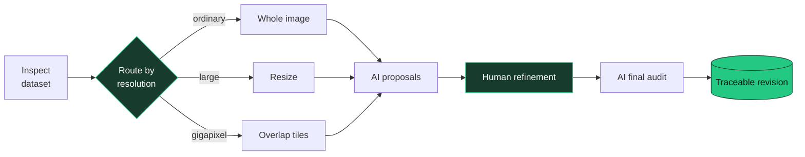

<div align="center">


### Local-first AI-assisted annotation for images of any resolution

Turn raw images into traceable, human-reviewed annotations — from everyday datasets to gigapixel scenes.

[](https://www.python.org/)
[](LICENSE)
[](#why-visionrefine)
[](#roadmap)

**[中文](#中文)** · **[English](#english)** · **[Quick start](#quick-start)** · **[Roadmap](#roadmap)**

</div>

---

## Why VisionRefine?

Most annotation tools assume an image fits comfortably in memory and an AI prediction is ready to become truth. VisionRefine makes neither assumption.

| | What it means |
|---|---|
| 🔒 **Local-first** | Source images stay on your machine; deleting a project never deletes the dataset. |
| 🔭 **Gigapixel-ready** | Inspect and edit original-resolution regions without flattening every image into a thumbnail. |
| 🧭 **Resolution-aware** | Route each image through direct input, resizing, overlapping tiles, or annotation-guided crops. |
| ✨ **AI-assisted** | Connect OpenAI-compatible APIs or vLLM for model discovery and pilot inference. |
| 🧑‍⚖️ **Human-owned** | AI suggestions and human-reviewed revisions remain separate; AI never silently overwrites approved work. |



## 中文

VisionRefine 是一个本地优先的 AI 辅助多模态数据标注工具。它会根据图像尺寸和已有标注，为每张图自动选择整图输入、缩放、重叠切片或标注引导裁剪，并把 **AI 初标 → 模型复核 → 人工精修 → AI 终检** 组织成可追踪的工作流。

当前原型重点支持目标检测与超高分辨率图像。AI 输出始终保存为独立建议版本，不会静默覆盖人工确认结果。

### 一眼看懂数据，再决定如何标注

项目分析页扫描图像数量、分辨率和已有粗标注，为每张图生成推荐处理路线。下面的数据集平均达到 **550 MP**，系统自动选择重叠切片。


### 在原始像素空间里精修

工作台按需读取原始分辨率区域。滚轮缩放、右键平移、左键新增框；选中框支持移动、八方向缩放和删除。所有坐标始终保存于原图坐标系。


### 当前能力

| 能力 | 状态 | 说明 |
|---|:---:|---|
| 数据集分析与分辨率路由 | ✅ | 图像统计、尺寸检查、粗标注识别与输入策略推荐 |
| 超高分辨率检测框编辑 | ✅ | 缩放、平移、新增、选择、移动、八方向缩放与删除 |
| OpenAI-compatible / vLLM | ✅ | 模型发现、单切片测试与整图切片测试 |
| 人工版本保护 | ✅ | AI 建议与人工确认结果分开保存，重新加载优先使用人工版本 |
| 多模态项目建模 | 🧪 | 检测、实例分割、视觉定位、描述、VQA、OCR 与分类 |
| 快速检测器与选择性 VLM 复核 | 🚧 | 开发中 |
| 分割编辑器与通用导入导出 | 🚧 | 开发中 |

### 基本流程

1. 新建项目，选择任务类型和候选标签。
2. 指定本地图像目录；如有粗标注，可同时提供标注文件。
3. 查看自动生成的分辨率路由，配置兼容 OpenAI API 的视觉模型。
4. 运行 AI 测试，或进入工作台进行人工校正。
5. 保存人工检查版本；后续 AI 复核只生成建议，不覆盖人工结果。

## English

VisionRefine is a local-first, AI-assisted multimodal annotation workspace. It inspects image dimensions and existing annotations, routes every image through the right input strategy, and connects **AI proposals → model review → human refinement → final AI audit** in one traceable workflow.

The current prototype focuses on object detection and ultra-high-resolution imagery. AI output is stored as a separate suggestion revision and never silently replaces human-reviewed annotations.

### Understand the dataset before annotating it

The project view reports image counts, dimensions, and existing annotations, then recommends an input route for every image. The dataset below averages **550 MP**, so VisionRefine selects overlapping tiles automatically.


### Refine annotations in original pixel space

The workspace loads original-resolution regions on demand. Scroll to zoom, right-drag to pan, and left-drag to create a box. Selected boxes can be moved, resized from eight handles, or deleted.


### Capability matrix

| Capability | Status | Details |
|---|:---:|---|
| Dataset inspection and routing | ✅ | Image statistics, dimensions, coarse annotations, and recommended input strategy |
| Ultra-high-resolution box editing | ✅ | Zoom, pan, create, select, move, eight-handle resize, and delete |
| OpenAI-compatible / vLLM adapters | ✅ | Model discovery, single-tile pilots, and tiled whole-image tests |
| Human revision protection | ✅ | AI suggestions stay separate; human-reviewed revisions win on reload |
| Multimodal project modeling | 🧪 | Detection, instance segmentation, grounding, captioning, VQA, OCR, and classification |
| Fast detectors and selective VLM review | 🚧 | In development |
| Segmentation editors and general import/export | 🚧 | In development |

### Workflow

1. Create a project and choose the task type and candidate labels.
2. Select a local image directory and, optionally, an existing coarse annotation file.
3. Review the generated resolution routes and configure an OpenAI-compatible vision model.
4. Run an AI pilot or open the annotation workspace for human correction.
5. Save the human-reviewed revision. Later AI passes remain suggestions and never overwrite it.

## Quick start

```bash
git clone https://github.com/Soleilor/VisionRefine.git
cd VisionRefine

python3 -m venv .venv
source .venv/bin/activate
pip install -e '.[dev]'

visionrefine --port 8020
```

Open **<http://127.0.0.1:8020>** and create your first project.

> VisionRefine requires Python 3.10 or newer. Your source images remain in their original directory; the workspace stores project metadata and revisions separately.

## Roadmap

- [x] Dataset inspection and automatic resolution routing
- [x] Tiled pilot inference through OpenAI-compatible APIs and vLLM
- [x] Original-resolution detection workspace
- [x] Separate AI and human revisions
- [ ] Fast detector adapters and candidate generation
- [ ] Selective VLM verification and final auditing
- [ ] Instance-segmentation editor
- [ ] COCO, YOLO, Label Studio, and CVAT import/export
- [ ] Collaborative review and revision history

## Development

```bash
git clone https://github.com/Soleilor/VisionRefine.git
cd VisionRefine
python3 -m venv .venv
source .venv/bin/activate
pip install -e '.[dev]'
pytest -q
```

VisionRefine is an early prototype. Issues, design discussions, and focused pull requests are welcome.

## Core team · 开发团队

<table>
  <tr>
    <td align="center" width="220">
      <a href="https://github.com/Soleilor">
        <br />
        <strong>Soleilor</strong>
      </a><br />
      <sub>Project Lead</sub>
    </td>
    <td align="center" width="220">
      <a href="https://github.com/J-TTTT">
        <br />
        <strong>J-TTTT</strong>
      </a><br />
      <sub>Developer</sub>
    </td>
  </tr>
</table>

## License

Licensed under the [Apache License 2.0](LICENSE).

<div align="center">

**See every pixel. Refine every label.**

</div>
