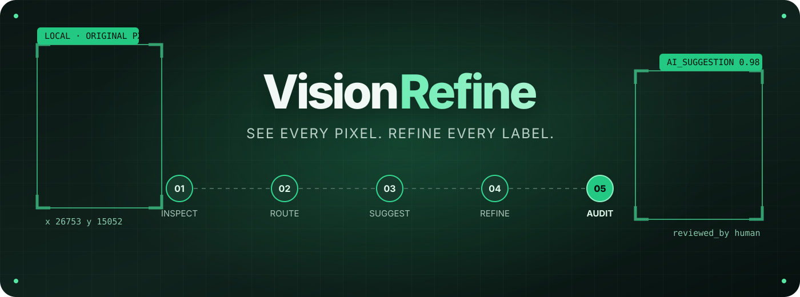
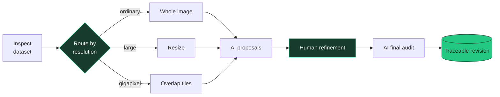
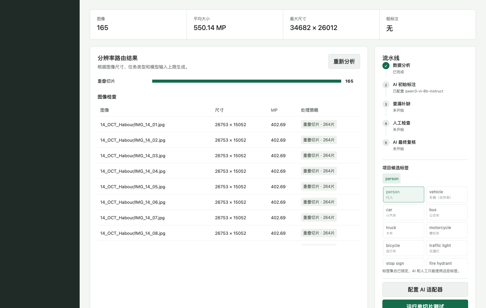
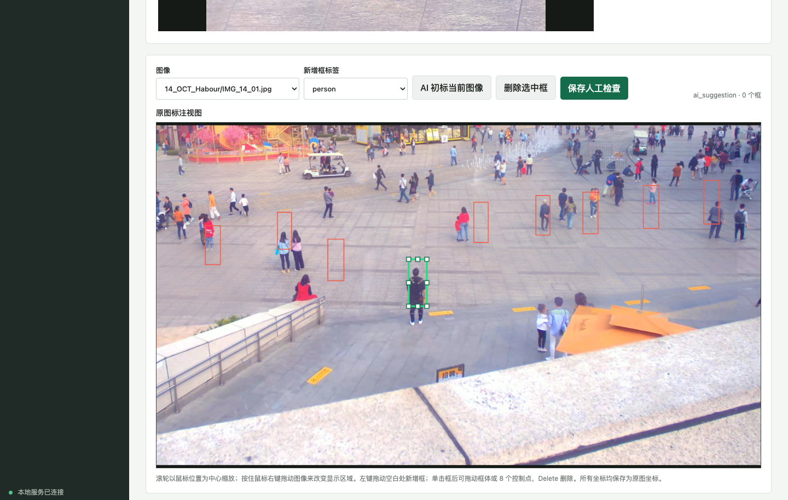

<div align="center">



### Local-first AI-assisted annotation for images of any resolution

Turn raw images into traceable, human-reviewed annotations — from everyday datasets to gigapixel scenes.

[](https://www.python.org/)
[](LICENSE)
[](#why-visionrefine)
[](#roadmap)

**[中文](#中文)** · **[English](#english)** · **[Quick start](#quick-start)** · **[Roadmap](#roadmap)**

</div>

---

## Why VisionRefine?

Most annotation tools assume an image fits comfortably in memory and an AI prediction is ready to become truth. VisionRefine makes neither assumption.

| | What it means |
|---|---|
| 🔒 **Local-first** | Source images stay on your machine; deleting a project never deletes the dataset. |
| 🔭 **Gigapixel-ready** | Inspect and edit original-resolution regions without flattening every image into a thumbnail. |
| 🧭 **Resolution-aware** | Route each image through direct input, resizing, overlapping tiles, or annotation-guided crops. |
| ✨ **AI-assisted** | Connect OpenAI-compatible APIs or vLLM for model discovery and pilot inference. |
| 🧑‍⚖️ **Human-owned** | AI suggestions and human-reviewed revisions remain separate; AI never silently overwrites approved work. |



## 中文

VisionRefine 是一个本地优先的 AI 辅助多模态数据标注工具。它会根据图像尺寸和已有标注，为每张图自动选择整图输入、缩放、重叠切片或标注引导裁剪，并把 **AI 初标 → 模型复核 → 人工精修 → AI 终检** 组织成可追踪的工作流。

当前原型重点支持目标检测与超高分辨率图像。AI 输出始终保存为独立建议版本，不会静默覆盖人工确认结果。

### 一眼看懂数据，再决定如何标注

项目分析页扫描图像数量、分辨率和已有粗标注，为每张图生成推荐处理路线。下面的数据集平均达到 **550 MP**，系统自动选择重叠切片。



### 在原始像素空间里精修

工作台按需读取原始分辨率区域。滚轮缩放、右键平移；“新增框”模式支持连续绘制和重叠绘制，“编辑框”模式支持移动、八方向缩放和删除。所有坐标始终保存于原图坐标系。



### 直接在画布上改框和标签

- 不同类别使用稳定的独立颜色，bbox 和标签底色保持一致。
- 单击已有框即可选中，并自动进入编辑模式；白色外边缘表示当前选中框。
- 单击图像上的标签，可从项目候选池中直接改类。
- 删除框或完成标签修改后，工具会自动回到“新增框”模式。
- 快捷键：`N` 新增框，`V` 编辑框，`Delete` 删除选中框。

### 当前能力

| 能力 | 状态 | 说明 |
|---|:---:|---|
| 数据集分析与分辨率路由 | ✅ | 图像统计、尺寸检查、粗标注识别与输入策略推荐 |
| 超高分辨率检测框编辑 | ✅ | 缩放、平移、连续/重叠绘制、选择、移动、八方向缩放与删除 |
| 画布内标签精修 | ✅ | 分类着色的框与标签，点击标签即可改类 |
| OpenAI-compatible / vLLM | ✅ | 模型发现、单切片测试与整图切片测试 |
| 人工版本保护 | ✅ | AI 建议与人工确认结果分开保存，重新加载优先使用人工版本 |
| 多模态项目建模 | 🧪 | 检测、实例分割、视觉定位、描述、VQA、OCR 与分类 |
| 快速检测器与选择性 VLM 复核 | 🚧 | 开发中 |
| Dataset I/O 通用导入导出框架 | ✅ | 仅图片导入；COCO / YOLO / VOC / CVAT / Label Studio / Labelme 检测格式与原生快照双向转换 |
| 多格式导出中心 | ✅ | 兼容性预检查、转换确认、同快照批量导出、预设、可取消/重试的持久化后台任务 |
| 多来源合并与安全追加 | ✅ | 导入预览、类别映射、重复图冲突处理、追加新数据与导入历史；保留人工 / AI 版本 |
| 分割编辑器与更多格式适配器 | 🚧 | 开发中 |

### 基本流程

1. 新建项目，选择任务类型和候选标签。
2. 选择导入格式和本地根目录；可添加多个 COCO / YOLO / VOC / 图片来源，预览类别映射和重复冲突后确认导入。
3. 查看自动生成的分辨率路由，配置兼容 OpenAI API 的视觉模型。
4. 运行 AI 测试，或进入工作台进行人工校正。
5. 保存人工检查版本；后续 AI 复核只生成建议，不覆盖人工结果。
6. 选择一个或多个目标格式、数据划分和标注版本；检查兼容性并逐项确认转换，后台生成并下载标注包或含图像副本的数据集。
7. 后续通过“追加数据”导入新批次或更新粗标注，不覆盖已有人工结果；“导入历史”记录每次操作。

详见 [Dataset I/O 使用说明与扩展接口](docs/dataset-io.md)。输入与输出格式可以不同；默认只导出人工确认结果。

新增格式的适用范围、原生包信任规则与开发模板见 [第一阶段格式中心](docs/format-center.md)。原生包默认重新导入为粗标注，只有明确勾选信任时才恢复审核状态；它不是完整项目备份。

## English

VisionRefine is a local-first, AI-assisted multimodal annotation workspace. It inspects image dimensions and existing annotations, routes every image through the right input strategy, and connects **AI proposals → model review → human refinement → final AI audit** in one traceable workflow.

The current prototype focuses on object detection and ultra-high-resolution imagery. AI output is stored as a separate suggestion revision and never silently replaces human-reviewed annotations.

### Understand the dataset before annotating it

The project view reports image counts, dimensions, and existing annotations, then recommends an input route for every image. The dataset below averages **550 MP**, so VisionRefine selects overlapping tiles automatically.


### Refine annotations in original pixel space

The workspace loads original-resolution regions on demand. Scroll to zoom and right-drag to pan. Draw mode supports continuous and overlapping box creation; Edit mode supports moving, eight-handle resizing, and deletion. Coordinates always remain in the original image space.


### Edit boxes and labels directly on the canvas

- Each class receives a stable, distinct color shared by its box and label background.
- Click an existing box to select it and enter Edit mode. A white outer stroke marks the active box.
- Click an on-canvas label to choose a replacement from the project's label pool.
- Deleting a box or choosing a label automatically returns the editor to Draw mode.
- Shortcuts: `N` for Draw mode, `V` for Edit mode, and `Delete` to remove the selected box.

### Capability matrix

| Capability | Status | Details |
|---|:---:|---|
| Dataset inspection and routing | ✅ | Image statistics, dimensions, coarse annotations, and recommended input strategy |
| Ultra-high-resolution box editing | ✅ | Zoom, pan, continuous/overlapping creation, selection, movement, eight-handle resize, and deletion |
| On-canvas label refinement | ✅ | Class-colored boxes and labels with click-to-relabel interaction |
| OpenAI-compatible / vLLM adapters | ✅ | Model discovery, single-tile pilots, and tiled whole-image tests |
| Human revision protection | ✅ | AI suggestions stay separate; human-reviewed revisions win on reload |
| Multimodal project modeling | 🧪 | Detection, instance segmentation, grounding, captioning, VQA, OCR, and classification |
| Fast detectors and selective VLM review | 🚧 | In development |
| Dataset I/O framework | ✅ | Image-only import; COCO / YOLO / VOC / CVAT / Label Studio / Labelme detection and native snapshots |
| Multi-format export center | ✅ | Compatibility consent, fixed-snapshot batches, presets, persistent cancel/retry jobs |
| Multi-source merge and safe append | ✅ | Import preview, category mapping, duplicate conflict policies, append/history with human and AI preservation |
| Segmentation editors and additional adapters | 🚧 | In development |

### Workflow

1. Create a project and choose the task type and candidate labels.
2. Select one or more local image/COCO/YOLO/VOC sources; preview category mappings and duplicate conflicts before committing.
3. Review the generated resolution routes and configure an OpenAI-compatible vision model.
4. Run an AI pilot or open the annotation workspace for human correction.
5. Save the human-reviewed revision. Later AI passes remain suggestions and never overwrite it.
6. Choose output formats, splits and revision policy; review compatibility, acknowledge conversions and download background-generated packages.
7. Append later batches or coarse updates without overwriting human reviews; inspect the import operation history.

See [Dataset I/O documentation](docs/dataset-io.md) for layouts, conversion limits and adapter development. Input and output formats are independent; exports default to human-reviewed data only.

## Quick start

```bash
git clone https://github.com/Soleilor/VisionRefine.git
cd VisionRefine

python3 -m venv .venv
source .venv/bin/activate
pip install -e '.[dev]'

visionrefine --port 8020
```

Open **<http://127.0.0.1:8020>** and create your first project.

> VisionRefine requires Python 3.10 or newer. Your source images remain in their original directory; the workspace stores project metadata and revisions separately.

## Roadmap

- [x] Dataset inspection and automatic resolution routing
- [x] Tiled pilot inference through OpenAI-compatible APIs and vLLM
- [x] Original-resolution detection workspace
- [x] Separate AI and human revisions
- [ ] Fast detector adapters and candidate generation
- [ ] Selective VLM verification and final auditing
- [ ] Instance-segmentation editor
- [x] Dataset I/O framework with COCO Detection, YOLO Detection and Pascal VOC Detection adapters
- [x] Multi-source preview/merge, explicit category mapping, safe append and import history
- [x] CVAT XML, Label Studio RectangleLabels, Labelme rectangles and native detection snapshots
- [x] Compatibility preflight, multi-format export presets and persistent local export jobs
- [ ] Additional task/format adapters: segmentation, keypoints, OCR, video and other detection conventions
- [ ] Collaborative review and revision history

## Development

```bash
git clone https://github.com/Soleilor/VisionRefine.git
cd VisionRefine
python3 -m venv .venv
source .venv/bin/activate
pip install -e '.[dev]'
pytest -q
```

VisionRefine is an early prototype. Issues, design discussions, and focused pull requests are welcome.

## Core team · 开发团队

<table>
  <tr>
    <td align="center" width="220">
      <a href="https://github.com/Soleilor">
        <br />
        <strong>Soleilor</strong>
      </a><br />
      <sub>Project Lead</sub>
    </td>
    <td align="center" width="220">
      <a href="https://github.com/J-TTTT">
        <br />
        <strong>J-TTTT</strong>
      </a><br />
      <sub>Developer</sub>
    </td>
  </tr>
</table>

## License

Licensed under the [Apache License 2.0](LICENSE).

<div align="center">

**See every pixel. Refine every label.**

</div>
