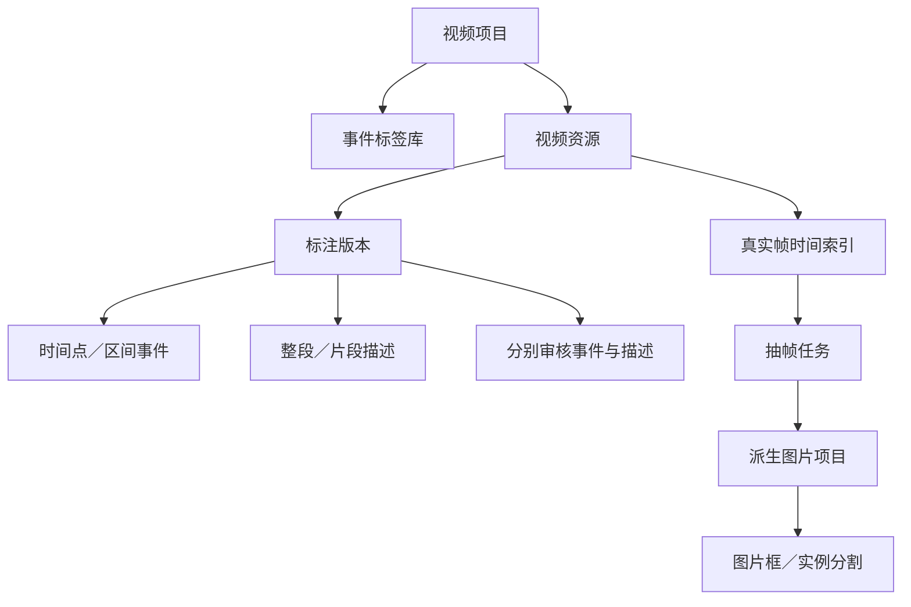

# 视频标注第一版：设计与验收

## 范围

第一版面向以几秒到 30 秒为主的通用视频，提供人工事件标注、整段／片段描述、抽帧和图片标注衔接。视频长度不是任务语义限制；处理资源仍有上限，超出时返回明确错误。

AI 描述、事件识别、跨帧对象轨迹和视频分割传播属于后续版本。抽出的图片可以使用已有的图片实例分割工作台。

## 启动

在项目目录安装视频依赖并启动：

```bash
pip install -e '.[video,segmentation]'
visionrefine --port 8020
```

打开 `http://127.0.0.1:8020/video`，或从首页点击“视频标注工作台”。视频处理使用 PyAV；无需额外安装系统 FFmpeg。只使用图片功能时，可以不安装视频依赖。

如果 VisionRefine 运行在 SSH 连接的服务器上，浏览器里的 `127.0.0.1` 指向浏览器所在机器。可让服务监听服务器的内网地址，例如 `visionrefine --host 10.10.0.41 --port 8022`，然后在能访问该内网的浏览器中打开 `http://10.10.0.41:8022/video`。不在同一内网时，可通过 SSH 端口转发访问。

## 工作台

- 左侧选择项目与视频，查看后台任务状态。
- 中间播放视频，支持音频、倍速和精确逐帧查看。
- 时间轴显示事件和片段描述，重叠事件独立显示。
- 标注区切换事件、描述和抽帧。
- 标签在项目内统一管理，事件标签与抽帧图片的对象类别相互独立。

视频资源引用本地原文件，预览、帧索引和缓存写入工作区。这里的本地路径指运行 VisionRefine 服务的机器上的路径。素材不需要发送给外部模型。

### 事件

支持持续区间和瞬时时间点；至少选择一个标签或填写一段描述，也可以同时填写。允许同一类别、不同类别的事件重叠。区间采用起点包含、终点不包含的约定 `[start, end)`；瞬时事件单独表达。时间以相对于首个视频帧的秒数保存。

标签有稳定 ID、名称与颜色。改名不改变已有引用；已被事件引用的标签不能直接删除。标签文件先在界面中预览再保存。

### 描述

一条描述对应整段视频或一个明确区间。每条记录包含 `visual`（仅视觉）或 `audiovisual`（视听）依据。同一视频可保存多条描述。自由文本按原文保存，不由软件自动补充或改写。

### 保存和审核

编辑后明确保存。切换视频、项目或离开页面时，对未保存内容给出提示。保存使用版本号检查，另一窗口的旧版本不能覆盖新版本。

事件和描述分别审核。保存草稿与确认整个任务的覆盖范围是不同操作；没有事件但已经检查完整段视频，也能明确确认。修改已经审核的内容后，应重新审核受影响的任务。

### 抽帧

支持当前帧、固定间隔、均匀数量和事件边界附近的采样。先预览并选择，再后台提取到图片项目。图片任务可选择目标检测或实例分割，使用自己的对象类别。

抽帧保留源视频标识、文件摘要、帧序号、实际时间戳和分组信息，默认继承视频的数据划分。同一视频的相邻帧不应随机分到训练集和验证集。

抽帧得到的图片归属于派生图片项目；删除视频项目不会移走这些图片。图片工作台提供返回来源视频的链接。图片的人工标注独立保存，第一版没有静默双向同步。

## 数据设计



视频功能单独存放在 `visionrefine/core/video/`，经独立 `/api/video` 路由接入。现有 `ProjectStore` 继续管理项目列表与可恢复删除；图片 Dataset I/O 不需要承载视频时间语义。

视频项目使用 `task=video` 作为第一版的工作台入口。事件、描述和抽帧在该项目内共存；将来新增对象轨迹时，作为视频标注的独立实体扩展，不使用事件 ID 替代对象 ID。

### 时间与媒体

- 逐帧索引基于解码帧的实际显示时间戳；不通过平均帧率计算可变帧率视频的帧位置。
- 播放预览与原始帧使用一致的时间原点和旋转方向。
- 同时生成 MP4（H.264/AAC）与 WebM（VP8/Opus）预览，浏览器按解码能力选择。WebM 的毫秒级播放时间精度不改变原始帧索引；逐帧查看与提取仍使用源视频时间戳。
- 编辑时的精确帧可以独立显示，避免将浏览器播放定位误认为精确抽帧。
- 源文件摘要用于识别内容变更；素材变更时不沿用旧索引继续抽帧。
- 预览、提取和导入在后台运行，记录进度，可取消和重试。

当前媒体处理上限是单文件 8 GiB、250,000 帧、6 小时时间轴及每帧 67,108,864 像素。播放预览最长边为 1280 像素，提取图片保留原始显示尺寸。存在多个音轨时，预览使用第一个音轨。缺少时间戳、时间戳重复或倒退、画面尺寸中途变化的素材会明确报错，需先修复或分段。

### 数据边界

- 几何标注仍使用原始显示画面的像素坐标。
- 事件和描述分别保存来源与审核状态。
- 保存创建历史版本；冲突返回错误并保留本地未保存内容。
- 导出原生 JSON 保存语义信息，不包含视频文件或机器上的绝对路径。
- 导出可选择全部内容或人工确认内容。
- 原生标注重新导入时按源视频指纹匹配，默认取消审核状态，避免把外部文件中的状态直接当作本地人工确认。

## 实施顺序

1. 视频模型、验证、独立路由及工作区持久化。
2. 解码、帧索引、播放预览和后台任务。
3. 事件与描述工作台、标签管理及保存冲突保护。
4. 抽帧预览、派生图片项目和来源跳转。
5. 审核、原生导出和重新导入。
6. API、媒体和浏览器验收，回归原有图片功能。

## 手工验收清单

以下测试建议使用实际素材再执行一次。

也可运行 `.venv/bin/python scripts/create_video_demo.py --output workspace/cache/video-demo` 生成三段合成素材，分别覆盖普通音视频、可变帧率和旋转画面。素材不包含真实人物或外部数据。

| 步骤 | 操作 | 预期 |
|---|---|---|
| 1 | 新建视频项目，导入视频文件或目录 | 任务显示进度，完成后出现视频 |
| 2 | 播放、拖动、倍速、逐帧前后 | 帧序号和实际时间同步，音频正常 |
| 3 | 新增标签，导入一组标签，再重命名 | 标签可选择，已有事件引用仍正确 |
| 4 | 添加标签事件、纯描述事件和瞬时事件 | 三种方式均可保存，允许重叠 |
| 5 | 编辑起止时间、重新打开事件 | 时间区间和文本一致 |
| 6 | 添加整段和片段描述，选择描述依据 | 内容与区间正确保存 |
| 7 | 保存后刷新页面 | 标注恢复，选中视频可继续编辑 |
| 8 | 修改后直接切换视频 | 给出未保存提示 |
| 9 | 两个窗口修改同一视频 | 旧版本保存被阻止，不覆盖新内容 |
| 10 | 确认事件审核，保留描述未审核 | 两个任务状态独立 |
| 11 | 预览抽帧，取消选择部分帧后提取 | 只生成选中的帧，重复帧被识别 |
| 12 | 打开图片项目画框／分割并保存 | 沿用现有图片编辑功能 |
| 13 | 点击图片来源链接 | 返回视频及对应帧 |
| 14 | 导出全部／已审核原生 JSON | 策略正确，包含时间与来源信息 |
| 15 | 在匹配素材中重新导入原生 JSON | 标注恢复，审核状态重置 |
| 16 | 取消后台任务，重试并刷新页面 | 状态可恢复，未完成结果不冒充完成 |

## 后续版本接口

视频实例分割将增加独立对象 ID、可见区间、逐帧几何和传播来源；事件可选关联对象。AI 任务使用输入版本生成建议，沿用人工版本保护。第一版不要求用户配置模型，也不伪造这些任务的完成状态。

## 本次验证记录

2026-09-30 执行 `VISIONREFINE_BROWSER_TESTS=1 .venv/bin/python -m pytest -q`，全部 **227 项通过**。其中包含真实 Chromium 的视频播放、标签文件导入、事件／描述保存后再次编辑、审核、原生导出回导和抽帧到图片工作台往返，以及原有图片、分割和 Dataset I/O 回归。

媒体测试覆盖可变帧率、非零时间原点、旋转、音轨对齐、MP4／WebM 预览、源文件变化与取消清理。演示工作台另已检查 1560 像素及 390 像素宽度，未发现横向溢出或脚本异常。仍建议按上方清单用实际业务素材进行验收。
